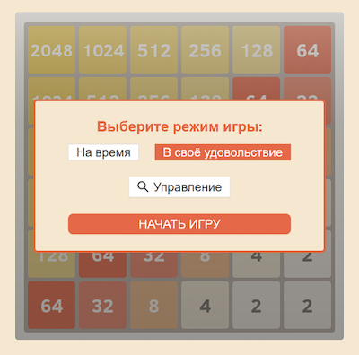

# Сценарий игры

Игра представляет собой головоломку, в которой игроку нужно набрать как можно большее количество баллов, передвигая вверх-вниз/вправо-влево по полю плитки с цифрами. Если у 2-х плиток одинаковое число, то они становятся одной плиткой и число удваивается. Цель игры - постепенно повышая сумму блоков дойти до числа 2048 или до самого высокого уровня в зависимости от рейтинга других участников.

На старте игры игроку предлагается 2 уровня сложности - играть на скорость по таймеру ("на время") или неограниченное количество времени "в свое удовольствие".

